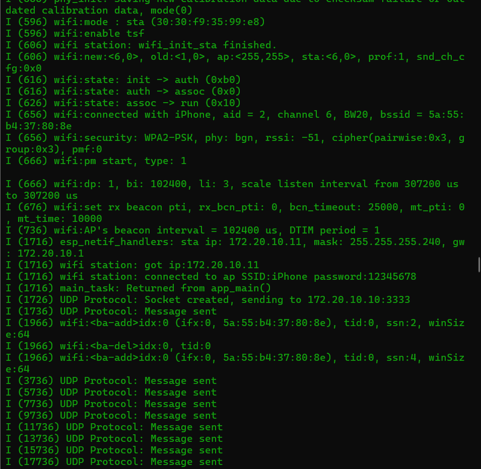
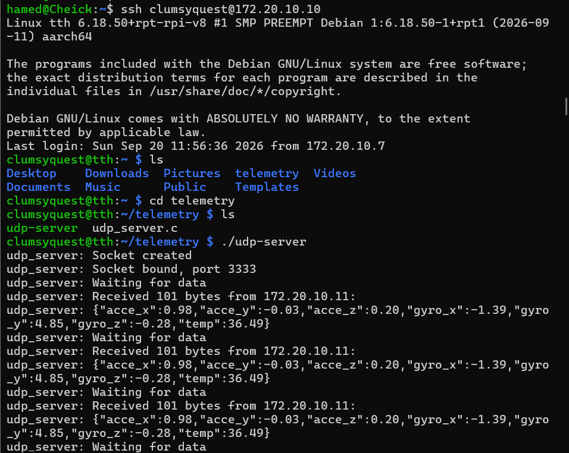
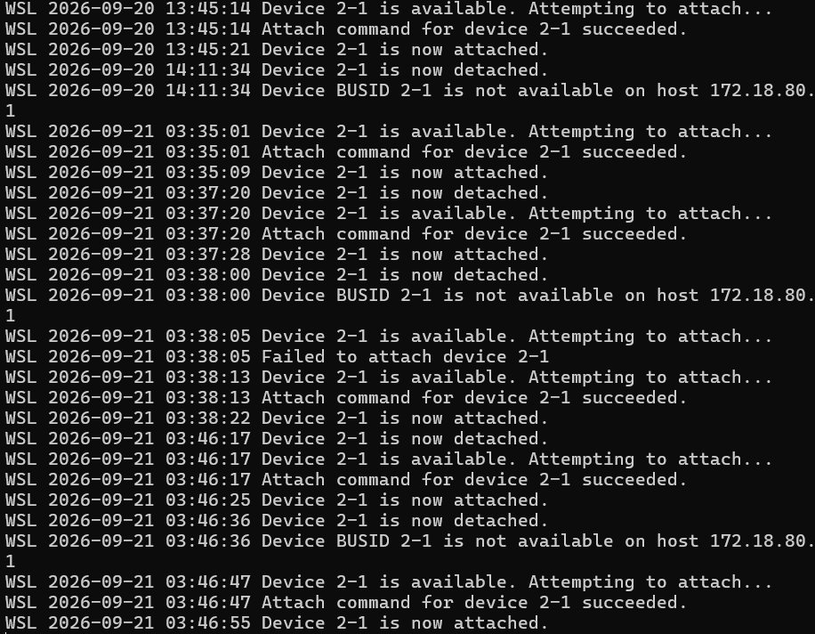

# Milestone 1 — Telemetry link online (ESP32 → Wi-Fi/UDP → Pi)

**Goal:** ESP32 reads a real sensor and sends its data as JSON over Wi-Fi/UDP to the Pi gateway, which receives and logs it — plaintext, end to end.

**Result:** ✅ done — MPU-6050 (accel + gyro + temp) streaming live to the gateway every 2s.

---

## Architecture for this milestone

\`\`\`
[ MPU-6050 ] --I2C--> [ ESP32-S3 ] --WiFi/UDP(JSON)--> [ Pi: udp_server.c ] --stdout-->
\`\`\`

## Steps

1. Set up ESP-IDF toolchain under WSL2, `idf.py create-project`.
2. Wi-Fi station connect (event-driven: `esp_event` + `EventGroup`, adapted from the official `station` example).
3. Read the MPU-6050 over I2C (`espressif/mpu6050` component via the IDF Component Manager).
4. Format sensor data as JSON, send over UDP (`lwip` sockets, BSD-socket API).
5. Port a matching UDP server to the gateway in plain C (POSIX sockets, no lwIP) — same socket API, different libc.

## Hurdles I hit (and how I solved them)

- **WSL2 doesn't see USB by default.** Fixed with `usbipd-win`, attaching the ESP32's USB-JTAG/serial device to WSL.
- **Native USB reset breaks the WSL passthrough.** Every hard reset re-enumerates the USB device; `usbipd attach --auto-attach` keeps it reattached automatically.
- **No `cdc_acm` driver loaded by default** in the WSL2 kernel — `modprobe cdc_acm` fixed it.
- **No udev under WSL2** → `/dev/ttyACM0` defaults to `root:root` on every reattach; worked around with `chmod 666` per session.
- **Brownout resets right after Wi-Fi init** — the radio's current spike exceeded a poor USB cable/port's supply; fixed with a better cable, not code.
- **CMake `SRCS` mismatch** — `create-project telemetry` generates `telemetry.c`, but an example's `main.c`-based `CMakeLists.txt` broke the build until filenames were reconciled.
- **Wrong board targeted** (`esp32c3` instead of ESP32-**S3**) — full `sdkconfig`/`build` wipe + `idf.py set-target esp32s3`.
- **`espressif/mpu6050` component missing its `driver` dependency** — added `driver` to `PRIV_REQUIRES` in the component's own `CMakeLists.txt`.

## Security note

Still plaintext, on purpose — this milestone proves the link works before adding crypto. AES + replay counter land in M2.

## Next

Milestone 2 — encrypt the payload (AES), add a replay counter, write the threat model.

## Proof

ESP32 sending JSON telemetry over UDP:

Pi gateway receiving and logging it:

USB passthrough to WSL2 (usbipd auto-attach):

